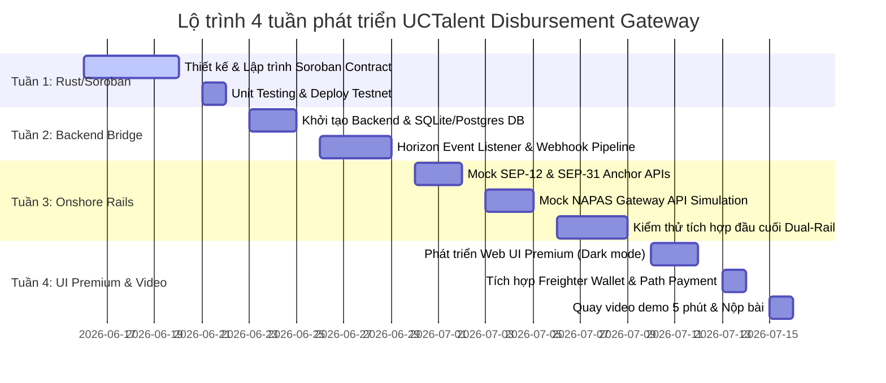

# 🌟 UCTalent Disbursement Gateway — Báo cáo yêu cầu dự án

Chào bạn! Dựa trên file mô tả chi tiết `doc.html` và định hướng của **APAC Stellar Hackathon 2026**, tôi đã tiến hành cấu trúc lại toàn bộ yêu cầu dự án một cách chuyên nghiệp và có hệ thống theo chuẩn **AI DevKit** của dự án.

Tôi đã khởi tạo cấu trúc tài liệu AI gồm 7 tài liệu tương ứng với các phase phát triển tại thư mục `docs/ai/` và điền chi tiết nội dung cho 3 phase quan trọng đầu tiên: **Requirements**, **System Design** và **Project Planning**.

Dưới đây là bản tóm tắt phân tích yêu cầu cốt lõi và lộ trình thực hiện dự án **UCTalent Disbursement Gateway**:

---

* 📋 1. Core Requirements & Problem (Vấn đề & Yêu cầu cốt lõi)

### Vấn đề cần giải quyết (The Problem)

Các startup/công ty công nghệ toàn cầu khi muốn thanh toán tiền công (bounty, salary) cho các lập trình viên remote (Talent) tại Việt Nam và Đông Nam Á đang gặp phải những thách thức lớn:

1. **Chuyển tiền xuyên biên giới chậm và đắt đỏ:** Hệ thống ngân hàng truyền thống mất từ 2-5 ngày với phí giao dịch cao qua nhiều ngân hàng trung gian.
2. **Thiếu lòng tin (Trust Deficit):** Client sợ Talent không bàn giao sản phẩm, còn Talent sợ Client bùng tiền sau khi làm xong.
3. **Rào cản pháp lý & Kế toán (Compliance & Accounting):** Khó giải trình thuế thu nhập cá nhân (PIT) và đối soát kế toán cho các khoản stablecoin rút ra tiền mặt (fiat VND) theo quy định nước sở tại (Nghị định 52/2024 và Quyết định 222/2025).

### Giải pháp: Programmable Payroll Router (Dual-Rail Model)

UCTalent hoạt động như một lớp hạ tầng định tuyến thanh toán trung gian, kết nối tính thanh khoản **USDC** ở offshore với hệ thống ngân hàng nội địa **VND** (onshore) thông qua **Stellar SEP-31 Corridor**. Hệ thống áp dụng mô hình **Dual-Rail (Đường ray kép)**: **Không bao giờ giữ tiền fiat của người dùng** mà chuyển tiếp tức thì (pass-through).

---

## 🏗️ 2. High-Level Architecture (Kiến trúc hệ thống)

Kiến trúc chia làm 3 lớp kỹ thuật tách biệt:

* **L1 (On-chain Layer):** Hợp đồng thông minh **Stellar Soroban (Rust)** quản lý Escrow, lock USDC, giải phóng theo cột mốc (milestone), timeout tự động và chia tách hoa hồng tự động (Atomic Commission Split) cho nhà tuyển dụng giới thiệu (Scout).
* **L2 (Bridge Layer):** Sử dụng **Stellar SDP & Horizon Event Listener** để theo dõi giao dịch on-chain real-time, bắt các event release và gửi webhook an toàn về hệ thống Backend.
* **L3 (Onshore Layer):** **Mock SEP-31 Anchor** và **Mock NAPAS Clearing System** tiếp nhận webhook, đối chiếu thông tin KYC người dùng (SEP-12) và thực hiện chuyển tiền VND trực tiếp vào tài khoản ngân hàng nội địa chỉ trong **dưới 10 giây**.

### Quy trình truy vết 4-ID đồng nhất (Traceability Chain)

Mỗi giao dịch thanh toán thành công sẽ kết nối 4 mã định danh độc nhất tỷ lệ 1-1, đảm bảo tính minh bạch kiểm toán 100%:

$$
\text{Soroban Tx Hash} \longleftrightarrow \text{Stellar Memo String} \longleftrightarrow \text{NAPAS Clearing ID} \longleftrightarrow \text{Bank Ref ID}
$$

---

## ⚡ 3. Các kịch bản biên quan trọng (Edge Cases)

Để đáp ứng tiêu chuẩn khắt khe của ban giám khảo Stellar Hackathon (đánh giá ứng dụng tài chính thực tiễn thay vì bản prototype lý thuyết), hệ thống đã thiết kế sẵn các kịch bản biên:

1. **EDGE-01 (Lỗi NAPAS):** Nếu ngân hàng từ chối giao dịch VND (do sai tài khoản, khóa thẻ), USDC vẫn được giữ an toàn trong Soroban Escrow. Hệ thống cập nhật trạng thái `PaymentFailed` để Talent cập nhật lại thông tin ngân hàng và tiến hành Retry.
2. **EDGE-02 (Client biến mất):** Áp dụng cơ chế **Timeout Auto-Release** sau 14 ngày. Nếu Client không duyệt giải phóng tiền và không mở tranh chấp, Soroban Contract sẽ tự động chuyển 100% tiền ký quỹ cho Developer.
3. **EDGE-03 (Tranh chấp - Dispute):** Khi xảy ra tranh chấp, 50% tiền được tự động trả trước cho Talent như một khoản thiện chí (good faith payment). 50% còn lại được đưa vào ví Multisig 3 bên: Client, Scout, Platform. Cần 2/3 chữ ký để giải quyết. Scout đóng vai trò trọng tài trung gian có động cơ kinh tế (nhận commission) để phân định công bằng.
4. **EDGE-04 (Thanh toán XLM):** Sử dụng **Stellar Path Payment Strict Receive** để Client có thể nạp tiền bằng XLM, hệ thống tự động swap sang USDC thông qua Stellar DEX trong 1 transaction nguyên tử duy nhất.

---

## 📅 4. Kế hoạch hành động 4 tuần (Project Roadmap)

Lộ trình phát triển 4 tuần (16/06 – 16/07/2026) được thiết kế chi tiết để hoàn thiện sản phẩm:

---

## 📂 5. Danh sách các tài liệu AI DevKit đã được tạo lập

Tôi đã khởi tạo và cấu trúc hóa toàn bộ thông tin trên vào các tài liệu chuyên biệt dưới đây trong dự án của bạn để các AI agent hoặc chính bạn dễ dàng theo dõi và thực thi:

1. **Yêu cầu chi tiết & Phân tích nghiệp vụ:**
   👉 [2026-06-01-feature-uctalent-disbursement-gateway.md (Requirements)](file:///Users/admin/repos/uc-cross-border/docs/ai/requirements/2026-06-01-feature-uctalent-disbursement-gateway.md)
2. **Thiết kế hệ thống, API và Hợp đồng thông minh:**
   👉 [2026-06-01-feature-uctalent-disbursement-gateway.md (Design)](file:///Users/admin/repos/uc-cross-border/docs/ai/design/2026-06-01-feature-uctalent-disbursement-gateway.md)
3. **Kế hoạch phân rã Task chi tiết hàng tuần, Rủi ro & Cách khắc phục:**
   👉 [2026-06-01-feature-uctalent-disbursement-gateway.md (Planning)](file:///Users/admin/repos/uc-cross-border/docs/ai/planning/2026-06-01-feature-uctalent-disbursement-gateway.md)

---

## 🚀 Bước tiếp theo khuyên nghị

Theo quy trình chuẩn của **AI DevKit**, các bước tiếp theo cần thực hiện là:

1. Chạy workflow kiểm thử yêu cầu bằng cách gõ: `/review-requirements` (Kiểm tra lại xem yêu cầu đã đầy đủ và chính xác chưa).
2. Chạy workflow kiểm thử thiết kế: `/review-design` (Đảm bảo kiến trúc khớp hoàn toàn với yêu cầu và sẵn sàng code).
3. Sau khi cả hai bước trên đạt yêu cầu, chúng ta sẽ bắt đầu thực thi kế hoạch: `/execute-plan` (Bắt đầu lập trình phần Soroban Smart Contract ở Phase 1).

Bạn thấy bản tóm tắt yêu cầu và lộ trình này thế nào? Chúng ta có cần điều chỉnh gì trước khi tiến hành bước review tiếp theo không?
