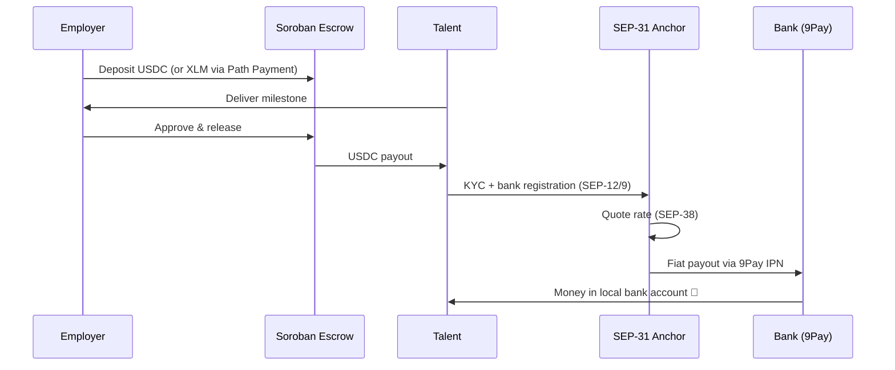

# UCTalent Stellar — Cross-Border Talent Payments

> Pay global talent in **USDC on Stellar** through milestone **escrow smart contracts** and a regulated **SEP-31 anchor off-ramp** into local bank accounts.

⚡ Near-instant settlement · 💸 <$0.01 network fee · 🔒 Milestone escrow · 🏦 SEP-31 anchor off-ramp

## 📜 Deployed Contract

| Contract | Network | Address |
|---|---|---|
| `uctalent-escrow` (Soroban milestone escrow) | Stellar Testnet | [`CBGJF7VDW7ZVTKWSQVIY2SJW5ZQHMH2OZQVPC7SQNJVIQURG66HZNY5K`](https://stellar.expert/explorer/testnet/contract/CBGJF7VDW7ZVTKWSQVIY2SJW5ZQHMH2OZQVPC7SQNJVIQURG66HZNY5K) |

## 🚀 Live Demo

No sign-up wall — pick an app and run the flow end to end on **Stellar testnet**:

- **Talent app** (candidate & employer): https://stellar.uctalent.io
- **ATS app** (business / hiring workspace): https://business.stellar.uctalent.io

You'll need the [Freighter](https://www.freighter.app/) wallet set to **Testnet**.

## 🎬 Demo Walkthrough (6 steps)

Six steps from posting a job to money landing in a local bank account. Each step maps to the exact on-chain action and Stellar SEP standard behind it:

1. **Connect wallet** — connect your Freighter wallet on Stellar testnet (**SEP-10** auth).
2. **Post & deposit** — employer posts a job and deposits into escrow: pay **USDC** directly, or send **XLM** and let **Path Payment** auto-swap it to USDC at the best on-chain rate.
3. **Escrow lock & deliver** — the deposit is held in the **Soroban milestone escrow contract**; the candidate applies and ships the milestone.
4. **Release** — employer approves the milestone; the escrow releases the deposit.
5. **Register bank** — talent claims the payout and registers a bank account with KYC (**SEP-12 · SEP-9**).
6. **Off-ramp** — the **SEP-31** anchor quotes the rate (**SEP-38**) and pays out fiat via **9Pay**.

## 🏗 Architecture

**Open core, secured product** — the cross-border payment engine (this repo) is open source. The proprietary product apps that wrap it stay private:

| Repository | Visibility | Description |
|---|---|---|
| **Payment Gateway** (this repo) | 🌐 Public | The open engine: Soroban escrow contract, SEP-31 anchor gateway (KYC, exchange rate, banking IPN) and the Stellar/banking packages |
| Talent Backend Service | 🔒 Private | Core product backend (jobs, payments, disbursement orchestration) |
| Talent Web App | 🔒 Private | Candidate & employer web experience powering stellar.uctalent.io |
| ATS Business App | 🔒 Private | Applicant-tracking & hiring workspace behind business.stellar.uctalent.io |

### What's inside this repo

A **NestJS + Rust monorepo** for Stellar cross-border disbursements. Everything that moves money is public and auditable:

```text
.
├── apps/
│   ├── api/            # SEP-31 cross-border payment gateway (NestJS)
│   └── worker/         # Background jobs & payout processing
├── packages/
│   ├── core/           # Shared domain logic, DB, demo seed/reset
│   ├── stellar/        # Stellar SDK helpers (SEP-10/12/31/38, Path Payment)
│   └── banking/        # 9Pay off-ramp integration & payout IPN webhooks
├── soroban/
│   └── contracts/
│       └── uctalent-escrow/   # Milestone escrow contract (Rust / Soroban)
├── anchor-platform/    # Anchor Platform configuration
└── showcase/           # Static landing / demo showcase page
```

### Stellar standards used

| Standard | Role |
|---|---|
| **SEP-10** | Wallet authentication |
| **SEP-12 · SEP-9** | Customer KYC & bank-account registration |
| **SEP-31** | Cross-border payments (anchor gateway) |
| **SEP-38** | Dynamic USDC ↔ fiat exchange-rate quotes |
| **Path Payment** | XLM → USDC swap at the best on-chain rate |
| **Soroban** | Milestone escrow smart contract (lock & release) |

## 🛠 Tech Stack

Stellar · Soroban · USDC · Path Payment · SEP-10 · SEP-12 · SEP-31 · SEP-38 · Freighter · NestJS · TypeScript · Rust

## 🏃 Getting Started

### Prerequisites

- Node.js ≥ 20 and npm
- Rust + [`stellar-cli`](https://developers.stellar.org/docs/tools/cli) (for the Soroban contract)
- Docker (optional, for `docker-compose.yml`)

### Install & run

```bash
# Install dependencies
npm install

# Build all workspaces
npm run build

# Apply pending SQL migrations (scripts/migrations/*.sql)
npm run db:migrate
# Seed the demo database
npm run db:seed

# Start the API (SEP-31 anchor gateway)
npm run start:api

# Start the background worker
npm run start:worker
```

### Build & test the Soroban contract

```bash
cd soroban
./build-and-test.sh

# Deploy to testnet
./run_testnet.sh
```

### Run with Docker

```bash
docker compose up
```

## 🔄 Payment Flow



## 📄 License

Built by [UCTalent](https://uctalent.io) · Cross-border talent payments on Stellar.
