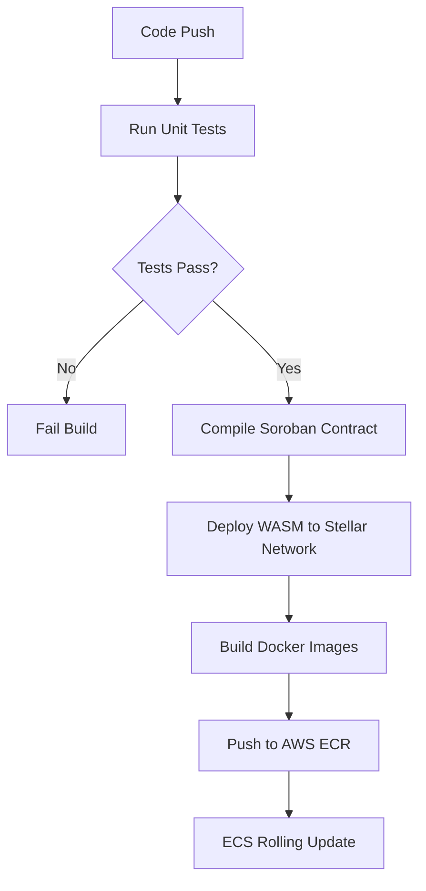

# Deployment Strategy

## Infrastructure

The UCTalent Cross-Border Bridge operates as a stateless microservice alongside the main UCTalent Backend.

| Component | Technology | Target Host | Environment |
|---|---|---|---|
| **Soroban Contracts** | WebAssembly | Stellar Testnet / Mainnet | Decentralized Ledger |
| **Event Listener** | Node.js | AWS ECS (Fargate) | Multi-AZ |
| **SEP-31 Anchor** | Express + SQLite | AWS ECS (Fargate) | Multi-AZ with EFS volume (for SQLite persistence) |
| **Database** | PostgreSQL | AWS RDS | Production UCTalent Backend |
| **Cache & Queue** | Redis | AWS ElastiCache | Production UCTalent Backend |

---

## Deployment Pipeline



### Pre-Deployment Checklist
- [ ] Verify 9Pay merchant account is pre-funded with sufficient VND liquidity.
- [ ] Verify `NINEPAY_SECRET_KEY` and HMAC keys are stored in AWS Secrets Manager.
- [ ] Confirm Stellar Anchor Account has established USDC trustline.
- [ ] Run database migration on AWS RDS.

### Smart Contract Deployment Steps
1. Build the release targets:
   ```bash
   cd soroban
   cargo build --target wasm32-unknown-unknown --release
   ```
2. Deploy the child contracts WASM:
   ```bash
   stellar contract install --wasm target/wasm32-unknown-unknown/release/uctalent_referral.wasm
   stellar contract install --wasm target/wasm32-unknown-unknown/release/uctalent_milestone.wasm
   ```
3. Deploy the Factory contract and initialize it with both Wasm hashes.

---

## Database Migrations

### NestJS Backend (PostgreSQL)
Run the TypeORM migration command:
```bash
npm run migration:run
```

### Bridge Service (SQLite)
The Express-based SQLite database manages schema creation automatically on startup using `CREATE TABLE IF NOT EXISTS`. No manual migrations are required. Backup of the SQLite database files is performed daily via AWS Backup EFS integration.

---

## Rollback Plan

### Triggers
- 9Pay callback processing failure rate exceeding 5%.
- Stellar RPC connectivity failure (timeout or invalid responses).
- Contract verification mismatch.

### Rollback Execution Steps
1. Revert ECS Task Definition to the previous stable version tag.
2. In case of contract failure: Pause the Factory contract creation flow from UCTalent backend and route payments to manual EVM fallback.
