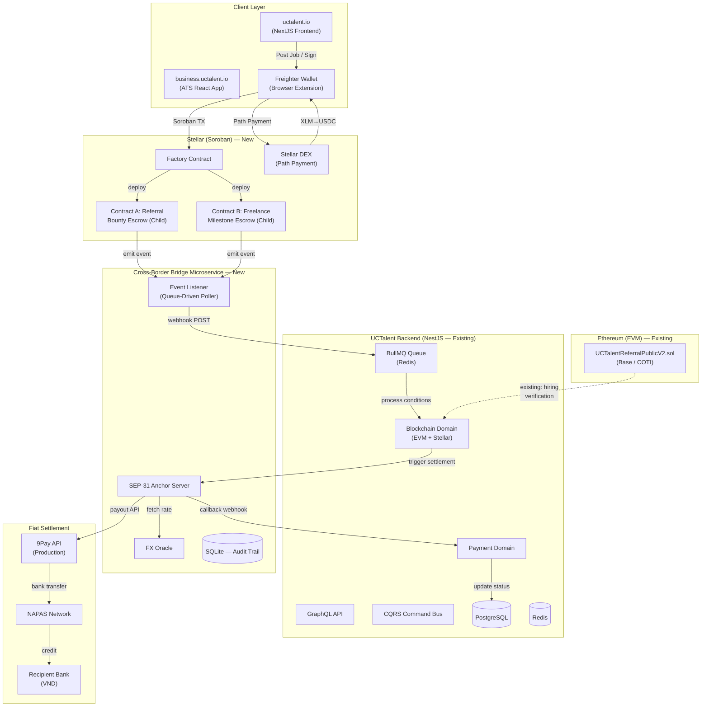
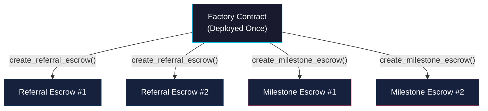
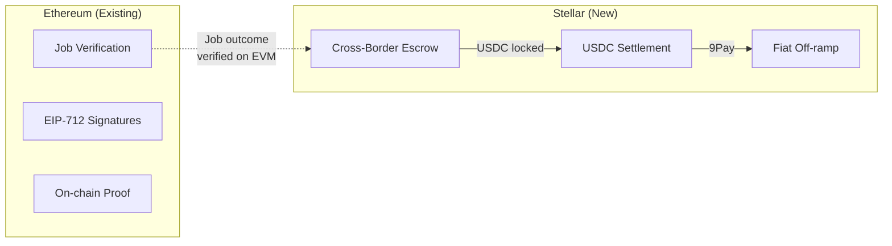

# System Design & Architecture

## Architecture Overview

### High-Level System Topology



### Technology Stack

| Layer | Technology | Rationale |
|---|---|---|
| Smart Contracts | Rust / Soroban SDK | Native Stellar smart contract support, 7-decimal USDC precision |
| Event Listener | Node.js + @stellar/stellar-sdk | Matches existing bridge codebase, mature RPC client |
| Anchor Server | Express.js + SQLite | Lightweight, self-contained, SEP-31 compliant |
| Queue | BullMQ + Redis (UCTalent Backend) | Already deployed and operational in production backend |
| FX Oracle | exchangerate-api.com → Stellar DEX TWAP | Free tier for testnet; production will use DEX oracle |
| Fiat Gateway | 9Pay Payout API | Vietnamese banking (NAPAS), HMAC-SHA256 auth, VND settlement |

---

## Smart Contract Design

### Contract Architecture: Factory-Child Pattern



**Rationale**: Factory-Child isolates each job/engagement into its own contract address, providing:
- Independent escrow state per job (no cross-contamination)
- Simpler event filtering (listen to specific child addresses)
- Parallel settlement without locking

### Contract A: Referral Bounty Escrow

```rust
// Simplified interface — production Soroban contract

pub struct ReferralConfig {
    pub client: Address,           // Hiring company
    pub referrer: Address,         // Headhunter who referred
    pub candidate: Address,        // Hired candidate (for dual-sign only)
    pub platform_address: Address, // UCTalent treasury
    pub anchor_address: Address,   // Bridge anchor (receives referrer share)
    pub token: Address,            // USDC token contract
    pub gross_bounty: i128,        // Total deposit (100%)
    pub platform_rate_bps: u32,    // 2000 = 20%
    pub expiry_ledger: u32,        // Auto-refund after expiry
    pub referrer_kyc_hash: BytesN<32>, // SHA-256 of bank details
}

pub struct ReferralStatus {
    pub is_deposited: bool,
    pub client_signed: bool,
    pub candidate_signed: bool,
    pub is_released: bool,
    pub is_refunded: bool,
}

// Entry points:
fn init(config: ReferralConfig);
fn deposit(client: Address);            // Client locks gross_bounty USDC
fn sign_release(signer: Address);       // Dual-sign: client OR candidate
fn release_bounty();                    // Auto-called when both signed
fn refund();                            // Client reclaims after expiry
fn get_status() -> ReferralStatus;
```

**Fee Split Logic** (on `release_bounty`):
```
gross_bounty = $1000 USDC (what client deposits)
platform_share = gross_bounty * 20% = $200 USDC → platform_address
referrer_share = gross_bounty * 80% = $800 USDC → anchor_address (for fiat conversion)
```

### Contract B: Freelance Milestone Escrow

```rust
pub struct MilestoneConfig {
    pub client: Address,
    pub freelancer: Address,
    pub platform_address: Address,
    pub anchor_address: Address,
    pub token: Address,
    pub milestones: Vec<i128>,       // [500_0000000, 300_0000000, 200_0000000]
    pub platform_rate_bps: u32,      // 2000 = 20%
    pub expiry_ledger: u32,
    pub freelancer_kyc_hash: BytesN<32>,
}

pub struct MilestoneStatus {
    pub is_deposited: bool,
    pub milestones_released: Vec<bool>, // [false, false, false]
    pub is_cancelled: bool,
}

// Entry points:
fn init(config: MilestoneConfig);
fn deposit(client: Address);                    // Client locks SUM(milestones) USDC
fn sign_milestone(signer: Address, index: u32); // Dual-sign per milestone
fn release_milestone(index: u32);               // Auto-called when both signed
fn cancel_remaining(client: Address);           // Refund unreleased milestones
fn get_status() -> MilestoneStatus;
```

**Fee Split Logic** (per milestone release):
```
milestone_amount = $500 USDC
platform_share = milestone_amount * 20% = $100 USDC → platform_address
freelancer_share = milestone_amount * 80% = $400 USDC → anchor_address
```

---

## Data Models

### Bridge Database (SQLite — sep31-anchor.js)

```sql
CREATE TABLE transactions (
    id           TEXT PRIMARY KEY,        -- UUID
    type         TEXT NOT NULL,           -- 'referral' | 'milestone'
    contract_id  TEXT NOT NULL,           -- Soroban child contract address
    job_id       TEXT,                    -- UCTalent job ID (from backend)
    
    -- On-chain data
    soroban_tx_hash    TEXT,
    gross_amount_usdc  REAL,
    platform_fee_usdc  REAL,
    net_amount_usdc    REAL,             -- Amount going to recipient
    
    -- FX & Settlement
    fx_rate            REAL,             -- USDC/VND rate at commitment
    vnd_amount         INTEGER,          -- Net amount in VND
    recipient_hash     TEXT,             -- SHA-256 of bank details
    
    -- 9Pay Settlement
    ninepay_payment_no TEXT,             -- 9Pay transaction reference
    napas_clearing_id  TEXT,             -- NAPAS clearing reference
    bank_ref           TEXT,             -- Bank reference number
    
    -- Status tracking
    status        TEXT DEFAULT 'pending', -- pending|committed|dispatched|cleared|failed
    fail_reason   TEXT,
    created_at    TEXT DEFAULT (datetime('now')),
    settled_at    TEXT,
    
    -- Audit
    stellar_memo  TEXT                    -- Unique memo for traceability
);

CREATE INDEX idx_transactions_contract ON transactions(contract_id);
CREATE INDEX idx_transactions_status ON transactions(status);
CREATE INDEX idx_transactions_job ON transactions(job_id);
```

### UCTalent Backend (PostgreSQL — existing tables to extend)

```sql
-- Extension to existing payment_distributions table
ALTER TABLE payment_distributions ADD COLUMN stellar_contract_id TEXT;
ALTER TABLE payment_distributions ADD COLUMN stellar_tx_hash TEXT;
ALTER TABLE payment_distributions ADD COLUMN settlement_type TEXT; -- 'crypto' | 'fiat_vnd'
ALTER TABLE payment_distributions ADD COLUMN bridge_transaction_id TEXT; -- FK to bridge DB
ALTER TABLE payment_distributions ADD COLUMN fx_rate DECIMAL;
ALTER TABLE payment_distributions ADD COLUMN vnd_amount BIGINT;
```

---

## API Design

### 1. Bridge → Backend Webhook (Event Notification)

```
POST /api/v1/cross-border/webhook
Authorization: HMAC-SHA256(payload, WEBHOOK_SECRET)
Content-Type: application/json

{
    "event": "escrow_released",          // | "escrow_deposited" | "escrow_refunded"
    "type": "referral",                  // | "milestone"
    "contract_id": "CASJTHVZ...",
    "soroban_tx_hash": "62f46257...",
    "gross_amount_usdc": 1000.00,
    "platform_fee_usdc": 200.00,
    "net_amount_usdc": 800.00,
    "recipient_kyc_hash": "73c1a8...",
    "milestone_index": null,             // Only for milestone type
    "timestamp": "2026-06-04T14:28:25Z"
}
```

### 2. Backend → Bridge (Trigger Settlement)

```
POST /api/anchor/disburse
Authorization: HMAC-SHA256(payload, WEBHOOK_SECRET)
Content-Type: application/json

{
    "job_id": "job-uuid-from-uctalent",
    "contract_id": "CASJTHVZ...",
    "soroban_tx_hash": "62f46257...",
    "amount_usdc": 800.00,
    "recipient": {
        "bank_code": "VCB",
        "account_number": "1234567890",
        "account_name": "NGUYEN VAN A"
    },
    "settlement_memo": "uctalent_disburse_123456"
}
```

### 3. Bridge → Backend (Settlement Callback)

```
POST /api/v1/cross-border/settlement-callback
Authorization: HMAC-SHA256(payload, WEBHOOK_SECRET)

{
    "bridge_transaction_id": "uuid",
    "status": "cleared",                 // | "failed"
    "ninepay_payment_no": "9PAY123...",
    "napas_clearing_id": "NAPAS456...",
    "bank_ref": "FT789...",
    "fx_rate": 25450,
    "vnd_amount": 20360000,
    "settled_at": "2026-06-04T14:30:00Z",
    "fail_reason": null
}
```

### 4. Anchor API (SEP-31 Compliant — existing)

| Method | Endpoint | Purpose |
|---|---|---|
| GET | `/.well-known/stellar.toml` | SEP-1 discovery |
| GET | `/sep31/info` | Anchor capabilities |
| POST | `/sep31/transactions` | Create transfer |
| GET | `/sep31/transactions/:id` | Poll transfer status |
| GET | `/api/anchor/transactions` | List all transactions (internal) |

---

## Component Breakdown

### 1. Soroban Contracts (Rust)

```
soroban/contracts/
├── uctalent-factory/         # Factory contract (deploy + track children)
│   └── src/lib.rs
├── uctalent-referral/        # Contract A: Referral Bounty Escrow
│   └── src/lib.rs
└── uctalent-milestone/       # Contract B: Freelance Milestone Escrow
    └── src/lib.rs
```

### 2. Cross-Border Bridge Microservice (Node.js)

```
disbursement-bridge/
├── src/
│   ├── listener.js           # Event Listener (queue-driven poller)
│   ├── sep31-anchor.js       # SEP-31 Anchor + 9Pay integration
│   ├── ninepay-client.js     # 9Pay API client (HMAC auth)
│   ├── oracle.js             # FX rate oracle (USDC/VND)
│   └── queue/
│       ├── event-queue.js    # Local event queue (Bull or in-memory)
│       └── processors/
│           ├── referral.js   # Process referral release events
│           └── milestone.js  # Process milestone release events
├── .env
└── package.json
```

### 3. UCTalent Backend Integration (NestJS)

```
uc-talent-backend/src/domains/
├── blockchain/
│   └── services/
│       ├── stellar-provider.ts    # NEW: Stellar/Soroban interaction
│       └── blockchain.service.ts  # EXTEND: add Stellar chain support
├── payment/
│   └── services/
│       ├── cross-border.service.ts # NEW: webhook handler + BullMQ jobs
│       └── payment.service.ts      # EXTEND: settlement type support
└── job/
    └── services/
        └── job.service.ts          # EXTEND: Soroban escrow creation on Post Job
```

---

## Design Decisions

### DD-1: Queue-Driven Listener vs. Direct Polling

| Aspect | Current (Polling) | New (Queue-Driven) |
|---|---|---|
| Contract limit | Breaks at >5 contracts per filter | Unlimited — chunks + queues |
| Latency | Fixed 5s poll interval | Event queued immediately on detection |
| Reliability | Lost events if listener crashes | Queue persistence (Redis/SQLite) |
| Intermediate logic | None — goes directly to 9Pay | BullMQ processes conditions first |
| **Decision** | | **✅ Queue-Driven** |

**Implementation**: Listener polls Soroban RPC in chunks of ≤5 contracts, pushes detected events into a local queue. Queue processor validates event, sends webhook to UCTalent backend. Backend's BullMQ handles business logic (ATS checks, conditions), then triggers bridge settlement.

### DD-2: Factory-Child vs. Shared Contract

| Aspect | Factory-Child | Shared (like EVM) |
|---|---|---|
| Isolation | Full — each job has own address | Shared state, job ID mapping |
| Gas efficiency | Higher deploy cost | Lower per-job cost |
| Event filtering | Listen to specific child | Filter by topic/job ID |
| Complexity | More complex deploy flow | Simpler single contract |
| **Decision** | **✅ Factory-Child** | |

**Rationale**: Soroban RPC event filtering works best with contract IDs. Shared contract with 100+ jobs would emit many irrelevant events. Factory-Child + queue-based listener is more scalable.

### DD-3: Dual-Chain Architecture



**Rationale**: EVM contracts handle hiring verification (already deployed, audited, has dispute flow). Stellar handles settlement (fast finality, low fees, native USDC, path payments, SEP-31 anchor ecosystem).

---

## Non-Functional Requirements

### Performance
- **Settlement latency**: < 5 minutes from on-chain release to VND bank credit
- **Event detection**: < 10 seconds from block confirmation to queue entry
- **Path payment**: < 30 seconds for XLM → USDC swap

### Scalability
- Support **1000+ active escrow contracts** simultaneously
- Queue-based listener handles contract ID chunking transparently
- Horizontal scaling: multiple listener instances with partition-by-contract-ID

### Security
- **HMAC-SHA256** authentication on all webhook payloads
- **KYC hash only** on-chain (SHA-256 of bank details, never raw PII)
- **Trustline validation** before any USDC transfer attempt
- **Expiry-based auto-refund** prevents locked funds indefinitely
- **9Pay IP whitelisting** for production API access

### Reliability
- **Dead-letter queue** for failed 9Pay settlements (retry with exponential backoff)
- **Idempotency**: Transaction deduplication by Soroban TX hash
- **SQLite WAL mode** for crash-safe audit trail persistence
- **Health checks**: Listener heartbeat + Anchor health endpoint

### Observability
- Structured logging (JSON) for all bridge components
- 4-way audit trail: Soroban TX → SEP-31 ID → NAPAS Clearing → Bank Ref
- Webhook to UCTalent backend on every state transition
