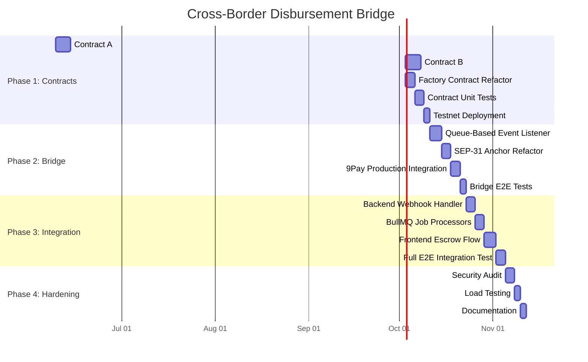

# Implementation Plan

## Phase Overview



---

## Task Breakdown

### Phase 1: Soroban Smart Contracts (18 days)

#### Task 1.1: Contract A — Referral Bounty Escrow
**Effort**: 5 days | **Priority**: Critical | **Dependencies**: None

- [x] **1.1.1** Define `ReferralConfig` and `ReferralStatus` types in `types.rs`
  - Fields: client, referrer, candidate, platform_address, anchor_address, token, gross_bounty, platform_rate_bps, expiry_ledger, referrer_kyc_hash
  - Platform rate default: 2000 (20%)
- [x] **1.1.2** Implement `init()` — validate config, store in instance storage
- [x] **1.1.3** Implement `deposit()` — client auth, transfer gross_bounty to contract
- [x] **1.1.4** Implement `sign_release(signer)` — dual-sign logic (client + candidate)
  - Track `client_signed` and `candidate_signed` independently
  - Auto-trigger `release_bounty()` when both are true
- [x] **1.1.5** Implement `release_bounty()` — internal function:
  - Calculate platform_share = gross_bounty * platform_rate / 10000
  - Calculate referrer_share = gross_bounty - platform_share
  - Transfer platform_share → platform_address
  - Transfer referrer_share → anchor_address
  - Emit `("uctalent", "referral_settled", contract_address)` event
- [x] **1.1.6** Implement `refund()` — client auth, only after expiry
- [x] **1.1.7** Implement `get_status()` — read-only status query

#### Task 1.2: Contract B — Freelance Milestone Escrow
**Effort**: 5 days | **Priority**: Critical | **Dependencies**: 1.1

- [x] **1.2.1** Define `MilestoneConfig` and `MilestoneStatus` types
  - milestones: Vec<i128> (amounts per milestone)
  - milestones_released: Vec<bool>
  - Per-milestone dual-sign tracking: Vec<(bool, bool)> (client, freelancer)
- [x] **1.2.2** Implement `init()` — validate milestones array, store config
- [x] **1.2.3** Implement `deposit()` — client locks SUM(milestones) USDC
- [x] **1.2.4** Implement `sign_milestone(signer, index)` — dual-sign per milestone
  - Validate index bounds
  - Track per-milestone signatures
  - Auto-trigger `release_milestone(index)` when both signed
- [x] **1.2.5** Implement `release_milestone(index)` — internal:
  - Calculate platform_share per milestone
  - Transfer freelancer_share → anchor_address
  - Emit `("uctalent", "milestone_released", contract_address, index)` event
- [x] **1.2.6** Implement `cancel_remaining(client)` — refund unreleased milestones
  - Sum all unreleased milestone amounts → transfer back to client
  - Emit `("uctalent", "milestone_cancelled", contract_address)` event
- [x] **1.2.7** Implement `get_status()` — return per-milestone release status

#### Task 1.3: Factory Contract Refactor
**Effort**: 3 days | **Priority**: Critical | **Dependencies**: 1.1, 1.2

- [x] **1.3.1** Extend Factory to support two WASM hashes (referral + milestone)
- [x] **1.3.2** Implement `create_referral_escrow(config)` → deploy + init Contract A
- [x] **1.3.3** Implement `create_milestone_escrow(config)` → deploy + init Contract B
- [x] **1.3.4** Emit `("uctalent_factory", "escrow_created", type)` event for both types

#### Task 1.4: Contract Unit Tests
**Effort**: 3 days | **Priority**: High | **Dependencies**: 1.1, 1.2, 1.3

- [x] **1.4.1** Test Contract A: deposit → dual-sign → release (happy path)
- [x] **1.4.2** Test Contract A: deposit → expiry → refund
- [x] **1.4.3** Test Contract A: fee split accuracy (20/80)
- [x] **1.4.4** Test Contract B: deposit → release milestone 1 → release milestone 2 → cancel remaining
- [x] **1.4.5** Test Contract B: partial release + refund of unreleased
- [x] **1.4.6** Test Factory: spawn both contract types
- [x] **1.4.7** Test edge cases: double-deposit, double-sign, unauthorized signer

#### Task 1.5: Testnet Deployment
**Effort**: 2 days | **Priority**: High | **Dependencies**: 1.4

- [x] **1.5.1** Build optimized WASM for all contracts
- [x] **1.5.2** Deploy Factory on Stellar Testnet
- [x] **1.5.3** Upload both child WASM hashes to Factory
- [x] **1.5.4** Smoke test: create referral escrow + deposit + release
- [x] **1.5.5** Smoke test: create milestone escrow + deposit + release M1 + cancel

---

### Phase 2: Bridge Microservice Refactor (12 days)

#### Task 2.1: Queue-Based Event Listener
**Effort**: 4 days | **Priority**: Critical | **Dependencies**: 1.5

- [x] **2.1.1** Refactor `listener.js` to use internal event queue instead of direct webhook
  - Poll Soroban RPC in chunks of ≤5 contract IDs
  - Push detected events into a local SQLite-backed queue
  - Separate poller from processor (producer/consumer pattern)
- [x] **2.1.2** Implement `lastProcessedLedger` persistence (SQLite)
  - Survive process restarts without re-processing old events
- [x] **2.1.3** Add dynamic contract discovery from Factory events
  - On startup: scan Factory history for `escrow_created` events
  - During runtime: detect new children from Factory events
- [x] **2.1.4** Add event type discrimination:
  - `referral_settled` → route to referral processor
  - `milestone_released` → route to milestone processor
  - `refund` → route to refund handler

#### Task 2.2: SEP-31 Anchor Refactor
**Effort**: 3 days | **Priority**: High | **Dependencies**: 2.1

- [x] **2.2.1** Add `type` field to transaction schema ('referral' | 'milestone')
- [x] **2.2.2** Add `milestone_index` field for milestone transactions
- [x] **2.2.3** Implement webhook callback to UCTalent backend on state transitions
- [x] **2.2.4** Add settlement deduplication by soroban_tx_hash (idempotency)

#### Task 2.3: 9Pay Production Integration
**Effort**: 3 days | **Priority**: High | **Dependencies**: 2.2

- [x] **2.3.1** Update `ninepay-client.js` for production API endpoints
- [x] **2.3.2** Implement IP whitelisting configuration
- [x] **2.3.3** Add retry logic with exponential backoff for failed payouts
- [x] **2.3.4** Implement dead-letter queue for permanently failed settlements

#### Task 2.4: Bridge E2E Tests
**Effort**: 2 days | **Priority**: High | **Dependencies**: 2.3

- [x] **2.4.1** Test: referral event → anchor → 9Pay payout → callback
- [x] **2.4.2** Test: milestone event → anchor → 9Pay payout → callback
- [x] **2.4.3** Test: 9Pay failure → retry → dead-letter
- [x] **2.4.4** Test: listener restart → resume from last processed ledger

---

### Phase 3: UCTalent Backend Integration (13 days)

#### Task 3.1: Backend Webhook Handler
**Effort**: 3 days | **Priority**: Critical | **Dependencies**: 2.4

- [x] **3.1.1** Create `CrossBorderController` in NestJS (REST endpoint)
  - `POST /api/v1/cross-border/webhook` — receive bridge events
  - `POST /api/v1/cross-border/settlement-callback` — receive 9Pay results
  - HMAC-SHA256 verification guard
- [x] **3.1.2** Create `CrossBorderService` — event processing logic
- [x] **3.1.3** Add DB migration: extend `payment_distributions` table

#### Task 3.2: BullMQ Job Processors
**Effort**: 3 days | **Priority**: Critical | **Dependencies**: 3.1

- [x] **3.2.1** Create `referral-settlement` queue processor
  - Validate job status in PostgreSQL
  - Check ATS pipeline conditions
  - // TODO: Future — check probation period
  - If conditions pass → POST to bridge `/api/anchor/disburse`
- [x] **3.2.2** Create `milestone-settlement` queue processor
  - Validate milestone index and job status
  - If conditions pass → POST to bridge `/api/anchor/disburse`
- [x] **3.2.3** Create `settlement-callback` processor
  - Update `payment_distributions` with 9Pay results
  - Send notification to referrer/freelancer

#### Task 3.3: Frontend Escrow Flow
**Effort**: 4 days | **Priority**: High | **Dependencies**: 3.2

- [x] **3.3.1** Add "Fund with Stellar" button on Job Post page (uctalent.io)
  - Freighter wallet connection
  - Path Payment option (XLM → USDC)
  - USDC trustline check + auto-open
- [x] **3.3.2** Add escrow status display on Job Detail page
- [x] **3.3.3** Add dual-sign UI for release consensus (Client + Candidate)
- [x] **3.3.4** Add settlement status tracker (pending → committed → cleared)

#### Task 3.4: Full E2E Integration Test
**Effort**: 3 days | **Priority**: Critical | **Dependencies**: 3.3

- [ ] **3.4.1** E2E: Post Job → Fund Escrow → Refer → Hire → Dual-sign → 9Pay → Bank
- [ ] **3.4.2** E2E: Create Freelance → Fund → Complete M1 → Release → 9Pay → Bank
- [ ] **3.4.3** E2E: Refund flow (expired escrow, cancelled milestones)

---

### Phase 4: Hardening (7 days)

#### Task 4.1: Security Audit & Code Hardening
**Effort**: 3 days | **Priority**: Critical | **Dependencies**: 3.4

- [ ] **4.1.1** Smart contract audit: overflow checks, auth verification, re-entrancy
- [ ] **4.1.2** Bridge audit: HMAC verification, SQL injection, rate limiting
- [ ] **4.1.3** Webhook security: replay protection, timestamp validation
- [x] **4.1.4** Remove hardcoded credentials and mock KYC/Oracle logic from anchor
- [x] **4.1.5** Modularize `sep31-anchor.js` into distinct service units (db, oracle, kyc)

#### Task 4.2: Load Testing
**Effort**: 2 days | **Priority**: High | **Dependencies**: 4.1

- [ ] **4.2.1** Simulate 100+ concurrent escrow contracts
- [ ] **4.2.2** Measure listener throughput and latency under load
- [ ] **4.2.3** 9Pay API rate limit testing

#### Task 4.3: Documentation
**Effort**: 2 days | **Priority**: Medium | **Dependencies**: 4.2

- [ ] **4.3.1** API documentation (OpenAPI/Swagger)
- [ ] **4.3.2** Smart contract deployment guide
- [ ] **4.3.3** Operator runbook (monitoring, troubleshooting, restart procedures)

---

## Risk Assessment

| Risk | Likelihood | Impact | Mitigation |
|---|---|---|---|
| 9Pay production API differs from sandbox | Medium | High | Start production integration early; maintain sandbox fallback |
| Stellar Mainnet gas costs higher than expected | Low | Medium | Pre-calculate worst-case fees; batch operations where possible |
| Exchange rate volatility during settlement | Medium | Medium | Lock FX rate at commitment time; settlement within 5-min SLA |
| Soroban contract size limits exceeded | Low | High | Keep contracts minimal; offload logic to bridge backend |
| BullMQ queue backup during high load | Low | Medium | Horizontal scaling; monitoring alerts on queue depth |

---

## Implementation Order (Critical Path)

```
1.1 (Contract A) → 1.2 (Contract B) → 1.3 (Factory) → 1.4 (Tests) → 1.5 (Deploy)
    → 2.1 (Listener) → 2.2 (Anchor) → 2.3 (9Pay) → 2.4 (Bridge Tests)
        → 3.1 (Backend) → 3.2 (BullMQ) → 3.3 (Frontend) → 3.4 (E2E)
            → 4.1 (Security) → 4.2 (Load Test) → 4.3 (Docs)
```

**Total estimated effort**: ~50 working days (10 weeks)
